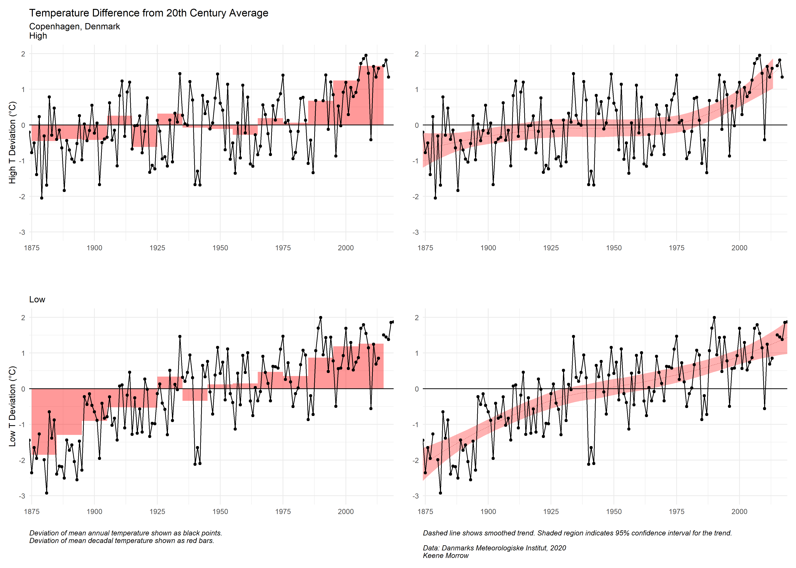

```{r setup, include=FALSE}
knitr::opts_chunk$set(include = FALSE, echo = TRUE, warning = FALSE, message = FALSE)

library(tidyverse)
library(here)
library(lubridate)
library(stringr)
library(broom)
library(patchwork)
```


```{r}
# Daily High Temperature (C)
T_high <- read_csv(here::here("data","dk_daily_112_kbh_highT.csv")) %>%
  rename(temp = elem_val) %>%
  mutate(temp_type = "High") %>% 
  mutate(date = lubridate::ymd(paste(year, month, day, sep = "-"))) %>% # concatenate dates and make them Date type
  mutate(month = as.numeric(month)) %>% # prep months for applying names
  mutate(month_name = month.abb[month]) %>%  # apply names to months
  mutate(month_name = fct_relevel(month_name, levels = month.abb)) %>% # relevel to get month names in order
  mutate(temp = as.numeric(temp)) 

# Daily Low Temperature (C)
T_low <- read_csv(here::here("data","dk_daily_122_kbh_lowT.csv")) %>%
  rename(temp = elem_val) %>%
  mutate(temp_type = "Low") %>% 
  mutate(date = lubridate::ymd(paste(year, month, day, sep = "-"))) %>% # concatenate dates and make them Date type
  mutate(month = as.numeric(month)) %>% # prep months for applying names
  mutate(month_name = month.abb[month]) %>%  # apply names to months
  mutate(month_name = fct_relevel(month_name, levels = month.abb)) %>% # relevel to get month names in order
  mutate(temp = as.numeric(temp)) 

# Daily T
temp <- T_high %>%
  full_join(T_low)

temp_nona <- temp %>%
  drop_na

T_high_nona <- T_high %>%
  drop_na

T_low_nona <- T_low %>%
  drop_na
```


```{r}
# High linear model
T_high_lm <- lm(temp ~ year, data = T_high_nona)

summary(T_high_lm)

T_high_lm_tidy <- broom::tidy(T_high_lm)
T_high_lm_tidy

# Intercept
T_high_int <- T_high_lm_tidy$estimate[1]

# Coefficient (T_high):
T_high_coef <- T_high_lm_tidy$estimate[2]

ggplot() +
  geom_point(data = T_high_nona,
             aes(x = date,
                 y = temp),
             alpha = 0.1) +
    geom_smooth(data = T_high_nona,
              aes(x = date,
                 y = temp),
              color = "dark red",
              size = 0.2,
              linetype = "dashed",
              fill = "red",
              alpha = 0.3)
  # geom_smooth(method = "lm", color = "blue")
  # geom_abline(intercept = T_high_int,
  #             slope = T_high_coef,
  #             color = "red")

# plot(T_high_lm)
```


```{r}
# Daily Accumulated Precipitation (mm)
precip <- read_csv(here::here("data","dk_daily_601_kbh_precip.csv")) %>%
  rename(precip = elem_val) %>%
   mutate(date = lubridate::ymd(paste(year, month, day, sep = "-"))) %>% # concatenate dates and make them Date type
  mutate(month = as.numeric(month)) %>% # prep months for applying names
  mutate(month_name = month.abb[month]) %>%  # apply names to months
  mutate(month_name = fct_relevel(month_name, levels = month.abb)) # relevel to get month names in order

precip_nona <- precip %>%
  drop_na

# linear model
precip_lm <- lm(precip ~ year, data = precip_nona)

summary(precip_lm)

precip_lm_tidy <- broom::tidy(precip_lm)
precip_lm_tidy

# Intercept
precip_int <- precip_lm_tidy$estimate[1]

# Coefficient (precip):
precip_coef <- precip_lm_tidy$estimate[2]

ggplot() +
  geom_point(data = precip_nona,
             aes(x = date,
                 y = precip),
             alpha = 0.3) +
    geom_smooth(data = precip_nona,
              aes(x = date,
                 y = precip),
              color = "navy",
              size = 0.2,
              linetype = "dashed",
              fill = "light blue",
              alpha = 0.5) 
  # geom_smooth(method = "lm", color = "blue")
  # geom_abline(yintercept = precip_int,
  #             slope = precip_coef,
  #             color = "blue")

```


```{r}
#### High T
# Temperature changes will impact the agricultural capabilities of the region.

annual_T_high <- T_high %>%
  drop_na %>% 
  group_by(year) %>%
  summarize(max_T = max(temp))

ggplot(data = annual_T_high) +
  geom_smooth(aes(x = year,
                  y = max_T),
              color = "dark red",
              size = 0.2,
              linetype = "dashed",
              fill = "red",
              alpha = 0.3) +
  geom_col(aes(x = year,
                y = max_T),
           fill = "red",
           alpha = 0.7) +
    labs(y = "Temperature (°C)",
         x = "",
         title = "Hottest Day of the Year",
         subtitle = "Copenhagen, Denmark",
         caption = "Dashed line shows smoothed trend. Shaded region indicates 95% confidence interval for the trend.\n\nData: Danmarks Meteorologiske Institut, 2020\nKeene Morrow") + 
    theme_minimal() +
    theme(plot.caption = element_text(hjust = 0, face = "italic")) +
  scale_x_continuous(expand = c(0,0))

ggsave(here::here("figures", "max_T.png"), width = 7, height = 5)

```

```{r}
#### Frost Days
# Frequency of daily minimum temperature <0*C

frost <- T_low %>% 
  mutate(frost_day = case_when(
    temp < 0 ~ 1,
    temp >= 0 ~ 0
  )) %>% 
  group_by(year) %>%
  summarize(frost_days = sum(frost_day))

ggplot(data = frost) +
  geom_smooth(aes(x = year,
                  y = frost_days),
              color = "navy",
              size = 0.2,
              linetype = "dashed",
              fill = "blue",
              alpha = 0.3) +
  geom_col(aes(x = year,
                y = frost_days),
           fill = "light blue",
           alpha = 0.7) +
    labs(y = "# Frost Days",
         x = "",
         title = "Frost Days per Year",
         subtitle = "Copenhagen, Denmark",
         caption = "Frost days are days when the low temperature is less than 0°C.\nDashed line shows smoothed trend. Shaded region indicates 95% confidence interval for the trend.\n\nData: Danmarks Meteorologiske Institut, 2020\nKeene Morrow") + 
    theme_minimal() +
    theme(plot.caption = element_text(hjust = 0, face = "italic")) +
  scale_x_continuous(expand = c(0,0))

ggsave(here::here("figures", "frost_days.png"), width = 7, height = 5)

```


```{r}
#### Wettest Day
wettest <- precip %>%
  group_by(year) %>%
  summarize(max_precip = max(precip))

ggplot(data = wettest) +
  geom_col(aes(x = year,
                y = max_precip),
           fill = "blue",
           # color = "grey50",
           alpha = 0.75) +
    labs(y = "Accumulated Precipitation (mm)",
         x = "Year",
         title = "Wettest Day of the Year",
         subtitle = "Copenhagen, Denmark",
         caption = "\nData: Danmarks Meteorologiske Institut, 2020\nKeene Morrow") + 
    theme_minimal() +
    theme(plot.caption = element_text(hjust = 0, face = "italic")) +
  scale_x_continuous(expand = c(0,0))

ggsave(here::here("figures", "wettest_day.png"), width = 7, height = 5)
```


```{r}
#### Season Average Temp (Low & High)
season_temp <- temp %>%
  mutate(Season = case_when(
    month %in% c(12, 01, 02) ~ "Winter",
    month %in% c(03, 04, 05) ~ "Spring",
    month %in% c(06, 07, 08) ~ "Summer",
    month %in% c(09, 10, 11) ~ "Fall",
  ),
  season_num = case_when(
    month %in% c(09, 10, 11) ~ "3",
    month %in% c(12, 01, 02) ~ "4",
    month %in% c(03, 04, 05) ~ "1",
    month %in% c(06, 07, 08) ~ "2"
  )) %>% 
  mutate(order = as.numeric(paste(year, ".", season_num, sep = ""))) %>% 
  drop_na()
  # mutate(temp = as.numeric(temp),
  #        lag_temp = lead(temp, order_by = date),
  #        lead_temp = lag(temp, order_by = date),
  #        state = is.na(temp),
  #        temp2 = case_when(
  #          is.na(temp) ~ (lag_temp + lead_temp)/2
  #        )) %>%
  # mutate(temp = case_when(
  #   is.na(temp) ~ (lag_temp + lead_temp/2),
  #   is.numeric(temp) ~ temp)
  #   )

season_avg_temp <- season_temp %>%
  group_by(year, Season, temp_type, order) %>%
  summarize(mean_temp = mean(temp))

season_avg_temp$Season <- factor(season_avg_temp$Season, levels = c("Spring", "Summer", "Fall", "Winter"))

ggplot(data = season_avg_temp) +
  geom_line(aes(x = order,
                y = mean_temp,
                color = Season)) +
  facet_wrap(~ temp_type) +
  scale_colour_manual(values = c("green", "red", "dark orange", "blue")) +
    labs(y = "Temperature (°C)",
         x = "Year",
         title = "Average Seasonal Temperature",
         subtitle = "Copenhagen, Denmark",
         caption = "\nData: Danmarks Meteorologiske Institut, 2020\nKeene Morrow") + 
    theme_minimal() +
    theme(plot.caption = element_text(hjust = 0, face = "italic")) +
  scale_x_continuous(expand = c(0,0))

ggsave(here::here("figures", "mean_season_temp.png"), width = 7, height = 5)
```


```{r}
#### Season Average Precipitation
season_precip <- precip %>%
  mutate(Season = case_when(
    month %in% c(12, 01, 02) ~ "Winter",
    month %in% c(03, 04, 05) ~ "Spring",
    month %in% c(06, 07, 08) ~ "Summer",
    month %in% c(09, 10, 11) ~ "Fall",
  ),
  season_num = case_when(
    month %in% c(09, 10, 11) ~ "3",
    month %in% c(12, 01, 02) ~ "4",
    month %in% c(03, 04, 05) ~ "1",
    month %in% c(06, 07, 08) ~ "2"
  )) %>% 
  mutate(order = as.numeric(paste(year, ".", season_num, sep = ""))) %>% 
  drop_na()

season_avg_precip <- season_precip %>%
  group_by(year, Season, precip, order) %>%
  summarize(mean_precip = mean(precip))

season_avg_precip$Season <- factor(season_avg_precip$Season, levels = c("Spring", "Summer", "Fall", "Winter"))

ggplot(data = season_avg_precip) +
  # geom_smooth(aes(x = order,
  #                 y = mean_precip,
  #               fill = Season),
  #             color = "black",
  #             size = 0.2,
  #             linetype = "dashed",
  #             alpha = 0.3) +
  # scale_colour_manual(values = c("green", "red", "dark orange", "blue")) +
  geom_point(aes(x = order,
                y = mean_precip,
                color = Season),
             alpha = 0.5) +
  scale_colour_manual(values = c("green", "red", "dark orange", "blue")) +
  facet_wrap(~ Season) +
  labs(y = "Accumulated Precipitation (mm)",
       x = "Year",
       title = "Mean Seasonal Precipitation",
       subtitle = "Copenhagen, Denmark",
       caption = "\nData: Danmarks Meteorologiske Institut, 2020\nKeene Morrow") + 
  theme_minimal() +
  theme(plot.caption = element_text(hjust = 0, face = "italic")) +
  scale_x_continuous(expand = c(0,0))

ggsave(here::here("figures", "mean_season_precip.png"), width = 7, height = 5)
```


```{r}
# Monthly Average T
month_temp <- temp %>%
  drop_na() %>%
  group_by(year, month_name, month, temp_type) %>%
  summarize(mean_temp = mean(temp)) %>%
  pivot_wider(names_from = temp_type, values_from = mean_temp, names_prefix = "mean_temp_") %>%
  mutate(mmyy = as.Date(paste(year, month, "01", sep = "-"))) %>%
  rename(Year = year)

monthly_T_high <- ggplot(data = month_temp) +
  geom_line(aes(x = month_name,
                y = mean_temp_High,
                group = Year,
                color = Year),
            show.legend = FALSE,
            alpha = 0.5) +
  scale_colour_gradient(
    low = "black",
    high = "red",
    space = "Lab",
    na.value = "grey50",
    guide = "colourbar",
    aesthetics = "colour"
  ) +
  labs(title = "Mean Monthly Temperature",
       subtitle = "Copenhagen, Denmark\n\nHigh",
       x = "",
       y = "Temperature (°C)",
       caption = "") +
  theme_minimal() +
  theme(plot.caption = element_text(hjust = 0, face = "italic")) +
  scale_x_discrete(expand = c(0,0))

monthly_low_T <- ggplot(data = month_temp) +
  geom_line(aes(x = month_name,
                y = mean_temp_Low,
                group = Year,
                color = Year),
            alpha = 0.5) +
  scale_colour_gradient(
    low = "black",
    high = "red",
    space = "Lab",
    na.value = "grey50",
    guide = "colourbar",
    aesthetics = "colour"
  ) +
  labs(title = "",
       subtitle = "\n\nLow",
       x = "",
       y = "",
       caption = "Data: Danmarks Meteorologiske Institut, 2020\nKeene Morrow") +
  theme_minimal() +
  theme(plot.caption = element_text(hjust = 0, face = "italic")) +
  scale_x_discrete(expand = c(0,0))

monthly_T_high + monthly_low_T

ggsave(here::here("figures", "mean_month_temp.png"), width = 7, height = 5)
```


```{r}
# Monthly Average Precip
month_precip <- precip %>%
  drop_na() %>%
  group_by(year, month_name, month) %>%
  summarize(mean_precip = mean(precip)) %>%
  mutate(mmyy = as.Date(paste(year, month, "01", sep = "-"))) %>%
  rename(Year = year)

ggplot(data = month_precip) +
  geom_line(aes(x = month_name,
                y = mean_precip,
                group = Year,
                color = Year),
            alpha = 0.5) +
  labs(title = "Mean Monthly Precipitation",
       subtitle = "Copenhagen, Denmark",
       x = "",
       y = "Mean Monthly Accumulated Precipitation (mm)",
       caption = "") +
  theme_minimal() +
  theme(plot.caption = element_text(hjust = 0, face = "italic")) +
  scale_x_discrete(expand = c(0,0))

ggsave(here::here("figures", "mean_month_precip.png"), width = 7, height = 5)
```


```{r}
#### 20th Century Average Deviation
##### Temperature
# temp_20 <- temp %>%
#   filter(year %in% 1900:1999) %>%
#   drop_na()
# 
# avg_temp_20 <- mean(temp_20$temp)
# 
# annual_temp <- temp %>%
#   drop_na() %>%
#   group_by(year) %>%
#   summarize(mean_annual_temp = mean(temp))%>%
#   mutate(temp_dev = mean_annual_temp - avg_temp_20)
# 
# decade_temp <- temp %>%
#   drop_na() %>%
#   mutate(decade = as.numeric(paste(str_sub(as.character(year), start = 1, end = 3), "0", sep = ""))) %>%
#   filter(year > 1879) %>%
#   group_by(decade) %>%
#   summarize(mean_decade_temp = mean(temp)) %>%
#   mutate(temp_dev = mean_decade_temp - avg_temp_20)
# 
# temp_dev_1 <-  ggplot() +
#   geom_col(data = decade_temp,
#            aes(x = decade,
#                y = temp_dev),
#            alpha = 0.4,
#            fill = "red",
#            width = 10) +
#   geom_hline(yintercept = 0) +
#   geom_line(data = annual_temp,
#              aes(x = year,
#                  y = temp_dev)) +
#   geom_point(data = annual_temp,
#              aes(x = year,
#                  y = temp_dev)) +
#   labs(y = "Temperature Deviation (°C)",
#        x = "",
#        title = "Temperature Difference from 20th Century Average",
#        subtitle = "Copenhagen, Denmark",
#        caption = "Deviation of mean annual temperature shown as black points.\nDeviation of mean decadal temperature shown as red bars.") + 
#   theme_minimal() +
#   theme(plot.caption = element_text(hjust = 0, face = "italic")) +
#   scale_x_continuous(breaks = c(1880, 1900, 1920, 1940, 1960, 1980, 2000, 2020)) +
#   scale_x_continuous(expand = c(0,0))
# 
# temp_dev_2 <-  ggplot()  +
#   geom_smooth(data = annual_temp,
#               aes(x = year,
#                   y = temp_dev),
#               color = "dark red",
#               size = 0.2,
#               linetype = "dashed",
#               fill = "red",
#               alpha = 0.3) +
#   geom_hline(yintercept = 0) +
#   geom_line(data = annual_temp,
#             aes(x = year,
#                 y = temp_dev)) +
#   geom_point(data = annual_temp,
#              aes(x = year,
#                  y = temp_dev)) +
#   labs(y = "",
#        x = "",
#        title = "",
#        subtitle = "",
#        caption = "Dashed line shows smoothed trend. Shaded region indicates 95% confidence interval for the trend.\n\nData: Danmarks Meteorologiske Institut, 2020\nKeene Morrow") + 
#   theme_minimal() +
#   theme(plot.caption = element_text(hjust = 0, face = "italic")) +
#   scale_x_continuous(breaks = c(1880, 1900, 1920, 1940, 1960, 1980, 2000, 2020)) +
#   scale_x_continuous(expand = c(0,0))
# 
# temp_dev_1 + temp_dev_2
# 
# ggsave(here::here("figures", "temp_dev_20.png"), width = 14, height = 5)

```


```{r}
#high

temp_high_20 <- T_high %>%
  filter(year %in% 1900:1999) %>%
  drop_na()

avg_temp_high_20 <- mean(temp_high_20$temp)

annual_temp_high <- T_high %>%
  drop_na() %>%
  group_by(year) %>%
  summarize(mean_annual_temp_high = mean(temp))%>%
  mutate(temp_dev = mean_annual_temp_high - avg_temp_high_20)

decade_temp_high <- T_high %>%
  drop_na() %>%
  mutate(decade = as.numeric(paste(str_sub(as.character(year), start = 1, end = 3), "0", sep = ""))) %>%
  filter(year > 1879) %>%
  group_by(decade) %>%
  summarize(mean_decade_temp_high = mean(temp)) %>%
  mutate(temp_dev = mean_decade_temp_high - avg_temp_high_20)

temp_dev_high_1 <-
ggplot() +
  geom_col(data = decade_temp_high,
           aes(x = decade,
               y = temp_dev),
           alpha = 0.4,
           fill = "red",
           width = 10) +
  geom_hline(yintercept = 0) +
  geom_line(data = annual_temp_high,
             aes(x = year,
                 y = temp_dev)) +
  geom_point(data = annual_temp_high,
             aes(x = year,
                 y = temp_dev)) +
  labs(y = "High T Deviation (°C)",
       x = "",
       title = "Temperature Difference from 20th Century Average",
       subtitle = "Copenhagen, Denmark\nHigh",
       caption = "") + 
  theme_minimal() +
  theme(plot.caption = element_text(hjust = 0, face = "italic")) +
  scale_x_continuous(breaks = c(1880, 1900, 1920, 1940, 1960, 1980, 2000, 2020)) +
  scale_x_continuous(expand = c(0,0)) +
  scale_y_continuous(limits = c(-3,2))

temp_dev_high_2 <-
  ggplot()  +
  geom_smooth(data = annual_temp_high,
              aes(x = year,
                  y = temp_dev),
              color = "dark red",
              size = 0.2,
              linetype = "dashed",
              fill = "red",
              alpha = 0.3) +
  geom_hline(yintercept = 0) +
  geom_line(data = annual_temp_high,
            aes(x = year,
                y = temp_dev)) +
  geom_point(data = annual_temp_high,
             aes(x = year,
                 y = temp_dev)) +
  labs(y = "",
       x = "",
       title = "",
       subtitle = "",
       caption = "") + 
  theme_minimal() +
  theme(plot.caption = element_text(hjust = 0, face = "italic")) +
  scale_x_continuous(breaks = c(1880, 1900, 1920, 1940, 1960, 1980, 2000, 2020)) +
  scale_x_continuous(expand = c(0,0)) +
  scale_y_continuous(limits = c(-3,2))
  
#Low
  
temp_low_20 <- T_low %>%
  filter(year %in% 1900:1999) %>%
  drop_na()
  
avg_temp_low_20 <- mean(temp_low_20$temp)

annual_temp_low <- T_low %>%
  drop_na() %>%
  group_by(year) %>%
  summarize(mean_annual_temp_low = mean(temp))%>%
  mutate(temp_dev = mean_annual_temp_low - avg_temp_low_20)

decade_temp_low <- T_low %>%
  drop_na() %>%
  mutate(decade = as.numeric(paste(str_sub(as.character(year), start = 1, end = 3), "0", sep = ""))) %>%
  filter(year > 1879) %>%
  group_by(decade) %>%
  summarize(mean_decade_temp_low = mean(temp)) %>%
  mutate(temp_dev = mean_decade_temp_low - avg_temp_low_20)

temp_dev_low_1 <-
ggplot() +
  geom_col(data = decade_temp_low,
           aes(x = decade,
               y = temp_dev),
           alpha = 0.4,
           fill = "red",
           width = 10) +
  geom_hline(yintercept = 0) +
  geom_line(data = annual_temp_low,
             aes(x = year,
                 y = temp_dev)) +
  geom_point(data = annual_temp_low,
             aes(x = year,
                 y = temp_dev)) +
  labs(y = "Low T Deviation (°C)",
       x = "",
       title = "",
       subtitle = "Low",
       caption = "Deviation of mean annual temperature shown as black points.\nDeviation of mean decadal temperature shown as red bars.\n\n") + 
  theme_minimal() +
  theme(plot.caption = element_text(hjust = 0, face = "italic")) +
  scale_x_continuous(breaks = c(1880, 1900, 1920, 1940, 1960, 1980, 2000, 2020)) +
  scale_x_continuous(expand = c(0,0)) +
  scale_y_continuous(limits = c(-3,2))

temp_dev_low_2 <-
  ggplot()  +
  geom_smooth(data = annual_temp_low,
              aes(x = year,
                  y = temp_dev),
              color = "dark red",
              size = 0.2,
              linetype = "dashed",
              fill = "red",
              alpha = 0.3) +
  geom_hline(yintercept = 0) +
  geom_line(data = annual_temp_low,
            aes(x = year,
                y = temp_dev)) +
  geom_point(data = annual_temp_low,
             aes(x = year,
                 y = temp_dev)) +
  labs(y = "",
       x = "",
       subtitle = "",
       caption = "Dashed line shows smoothed trend. Shaded region indicates 95% confidence interval for the trend.\n\nData: Danmarks Meteorologiske Institut, 2020\nKeene Morrow") + 
  theme_minimal() +
  theme(plot.caption = element_text(hjust = 0, face = "italic")) +
  scale_x_continuous(breaks = c(1880, 1900, 1920, 1940, 1960, 1980, 2000, 2020)) +
  scale_x_continuous(expand = c(0,0)) +
  scale_y_continuous(limits = c(-3,2))

(temp_dev_high_1 + temp_dev_high_2)/(temp_dev_low_1 + temp_dev_low_2)

ggsave(here::here("figures", "temp_dev_20.png"), width = 14, height = 10)

```


```{r}
#### 20th Century Average Deviation
##### Precipitation
precip_20 <- precip %>%
  filter(year %in% 1900:1999) %>%
  drop_na()

avg_precip_20 <- mean(precip_20$precip)

annual_precip <- precip %>%
  drop_na() %>%
  group_by(year) %>%
  summarize(mean_annual_precip = mean(precip))%>%
  mutate(precip_dev = mean_annual_precip - avg_precip_20)

decade_precip <- precip %>%
  drop_na() %>%
  mutate(decade = as.numeric(paste(str_sub(as.character(year), start = 1, end = 3), "0", sep = ""))) %>%
  filter(year > 1879) %>%
  group_by(decade) %>%
  summarize(mean_decade_precip = mean(precip)) %>%
  mutate(precip_dev = mean_decade_precip - avg_precip_20)

precip_dev_1 <- ggplot() +
  geom_col(data = decade_precip,
           aes(x = decade,
               y = precip_dev),
           alpha = 0.4,
           fill = "blue",
           width = 10) +
  geom_hline(yintercept = 0) +
  geom_line(data = annual_precip,
             aes(x = year,
                 y = precip_dev)) +
  geom_point(data = annual_precip,
             aes(x = year,
                 y = precip_dev)) +
  labs(y = "Precipitation Deviation (mm)",
       x = "",
       title = "Precipitation Difference from 20th Century Average",
       subtitle = "Copenhagen, Denmark",
       caption = "Deviation of mean annual precipitation shown as black points.\nDeviation of mean decadal precipitation shown as blue bars.\n\n") + 
  theme_minimal() +
  theme(plot.caption = element_text(hjust = 0, face = "italic")) +
  scale_x_continuous(breaks = c(1880, 1900, 1920, 1940, 1960, 1980, 2000, 2020)) +
  scale_x_continuous(expand = c(0,0))

precip_dev_2 <- ggplot()  +
  geom_smooth(data = annual_precip,
              aes(x = year,
                  y = precip_dev),
              color = "navy",
              size = 0.2,
              linetype = "dashed",
              fill = "light blue",
              alpha = 0.5) +
  geom_hline(yintercept = 0) +
  geom_line(data = annual_precip,
            aes(x = year,
                y = precip_dev)) +
  geom_point(data = annual_precip,
             aes(x = year,
                 y = precip_dev)) +
  labs(y = "",
       x = "",
       title = "",
       subtitle = "",
       caption = "Dashed line shows smoothed trend. Shaded region indicates 95% confidence interval for the trend.\n\nData: Danmarks Meteorologiske Institut, 2020\nKeene Morrow") + 
  theme_minimal() +
  theme(plot.caption = element_text(hjust = 0, face = "italic")) +
  scale_x_continuous(breaks = c(1880, 1900, 1920, 1940, 1960, 1980, 2000, 2020)) +
  scale_x_continuous(expand = c(0,0))

precip_dev_1 + precip_dev_2

ggsave(here::here("figures", "precip_dev_20.png"), width = 14, height = 5)

```


#### Background
Copenhagen is the capital of Denmark.  Located on the east side of Denmark's largest island, Zealand, Copenhagen is separated from Sweden by the Øresund.  In the author's experience, the city is dominated by paved areas but has numerous parks and easy access to the harbor for recreation.  Topographically, the city, like the rest of Denmark, is remarkably flat.


*Copenhagen's location within Denmark. Source: Wikipedia*

As a coastal city, Copenhagen is particularly vulnerable to sea level rise and coastal flooding.  Local fisheries will be impacted by the shift of marine species towards higher latitudes.  Changes in precipitation and the exacerbation of extreme weather may impact agriculture in the area, both positively (increased cereal yields, possibility of wine grape cultivation) and negatively (increased pest activity, impact of heat on livestock). Extreme heat and cold are expected to have significant socioeconomic and health effects. (IPCC 2014)


#### Data

Data from the Danish Meterological Institute (Danmarks Meteorologiske Institut) meteorological station at Landbohøjskolen, Københavns Universitet (Land High School, University of Copenhagen) will be used to assess the climate trends from January 1, 1874 and December 31, 2019.  The precipitation data contained 44834 daily observations.  No data was available for `r 45106 - 44834` days within the observation period.  The temeprature data contained `r as.character(53274 + 53283)` daily high and low observations.  No data was available for `r 106652 - (53274 + 53283)` days within the observation period.  

#### Analysis

Annual and decadal deviation from the 20th century average were calculated for both temperature and precipitation.  Temperature deviation increases through time, with more deviation in daily low temperatures.  While days in Copenhagen are getting warmer, nights are getting hotter. (Figure 1)  Only a slight upward trend after 1960 emerges from the same analysis of precipitation (Figure 2)



*Figure 1*


*Figure 2*


The reduction in daily temperatures is reflected in the number of frost days over time. A decline is noticable throughout the observation period, with a more rapid decline in before 1925 and after 1975. (Figure 3)  Fewer frost days may cause an increase in agricultural pests in the region due to decrease die offs from freezing temepratures.


*Figure 3*

An examination of changes in seasonal mean high temperature show that the greatest impacts to temperature can be seen during the winter, spring, and fall.  Lows, by contrast, follow similar upward trends regardless of season. (Figure 4)  This suggests that extreme heat may not be an immediate concern of those raising livestock.  The concavity of the trend in the hottest day of the year suggests that extreme heat may become of increasing concern in the future. (Figure 5)


*Figure 4*


*Figure 5*

Monthly mean temperatures (Figure 6) show the most deviation from historic records in winter months, particularly in lows.  Like other metrics, monthly mean lows have seen more consistent elevation than highs.


*Figure 6*

Seasonal and monthly trends in precipitation are difficult to discern.  There may be a slight increase in spring precipitation.  Other trends could not be discerned. (Figures 7 & 8)


*Figure 7*


*Figure 8*


#### Conclusion

Copenhagen has historically benefited from a mild maritime climate.  Ocean warming may exacerbate existing upward trends in temperature, especially lows.  There has been little discernable change in precipitation to date, but continued disruption to temperatures may force more extreme increases in precipitation.  These trends may significantly impact agricultural systems in Denmark as a whole.

***

#### References

IPCC, 2014. "AR5 Climate Change 2014: Impacts, Adaptation, and Vulnerability, Part B: Regional Aspects." https://www.ipcc.ch/report/ar5/wg2/

Cappelen, John. 2020. "DMI Report 20-02 Denmark - DMI Historical Climate Data Collection 1768-2019." Danmarks Meteorologiske Institut. https://www.dmi.dk/fileadmin/user_upload/Rapporter/TR/2020/DMIRep20-02.pdf
